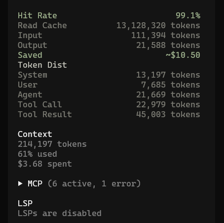

<div align="center">

# OpenCode Cache Stats

</div>

---

## overview



---

## Installation

### OpenCode Command (recommended)

Press **`Ctrl + P`** in OpenCode to open the command palette, search **`install plugin`**, then type:

```
opencode-cache-stats@latest
```

Press Enter to install and configure automatically.

### Manual

**Install the plugin**

```bash
npm install -g opencode-cache-stats@latest
```

**Configure TUI plugin**

Create or edit `~/.config/opencode/tui.jsonc`:

```jsonc
{
  "$schema": "https://opencode.ai/tui.json",
  "plugin": ["opencode-cache-stats@latest"]
}
```

### Restart OpenCode

Open any session — the cache stats panel appears in the sidebar.

---

## License

[MIT](LICENSE)